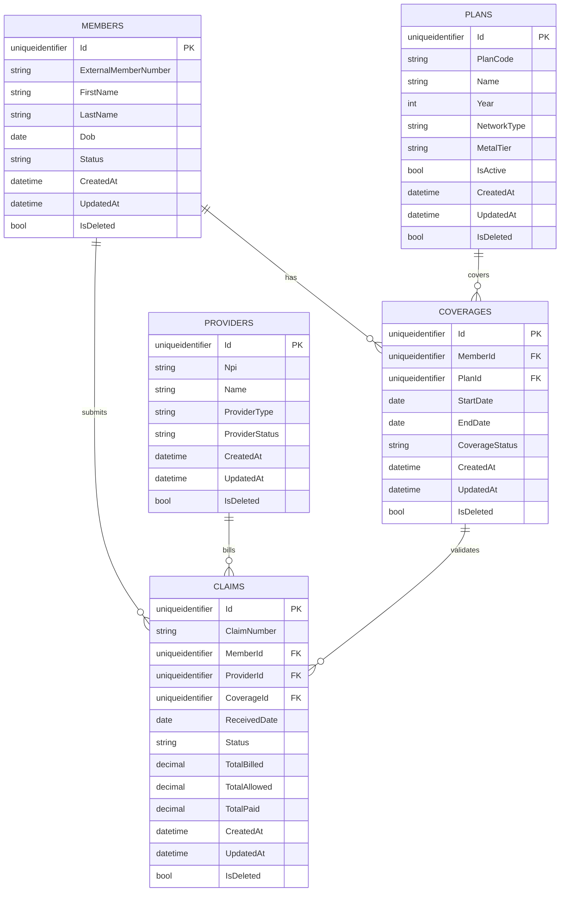

# Database design and schema

This folder documents the SQL schema for the PayorClaims GraphQL application: design choices, core invariants, ERD, table reference, and how to keep docs in sync after migrations.

---

## Design explanation

- **Soft delete:** Entities inheriting `BaseEntity` have `IsDeleted` and `DeletedAt`. EF global query filters exclude `IsDeleted == true`. Deletes are implemented as soft delete (state change to Modified, set IsDeleted/DeletedAt). See `ClaimsDbContext.ApplyBaseEntityConventions`.
- **RowVersion (concurrency):** Claims (and other entities with `RowVersion`) use SQL Server `rowversion` for optimistic concurrency. On SQLite (tests), RowVersion is configured with `ValueGeneratedNever()` so a value can be supplied on insert. Adjudication mutations require the client to send the current `rowVersion` (base64); on mismatch, the API returns `CONCURRENCY_CONFLICT`.
- **Idempotency:** Claims have `IdempotencyKey`; duplicate submission can be detected. `DuplicateFingerprint` is also stored for duplicate detection (verify in code for exact logic).
- **HIPAA access logs:** `HipaaAccessLog` is append-only (no updates/deletes). Enforced in `ClaimsDbContext.EnforceHipaaAccessLogAppendOnly`. Each row participates in a hash chain (PrevHash, Hash) for integrity.
- **Audit events:** `AuditEvent` is append-only with a hash chain. `AuditChainValidationJob` runs hourly to verify chain integrity. See [HIPAA & audit](../security/hipaa-audit.md).

---

## Core invariants

- **Claim and coverage:** A claim should reference an active coverage for the service dates (enforcement in application layer; verify in `ClaimService`).
- **One EOB per claim:** (Verify in code: EOB creation and uniqueness.)
- **Payment idempotency:** Payments keyed so duplicate requests do not create duplicate payments (verify in code: idempotency key usage).
- **Logs append-only:** HipaaAccessLog and AuditEvent must never be updated or deleted; enforced in DbContext SaveChanges.

---

## ER diagram (Mermaid)

The canonical Mermaid source is [erd.mmd](erd.mmd). Below is a simplified excerpt (core entities and relations); for the full diagram open [erd.mmd](erd.mmd).



For the full entity set and relations, open [erd.mmd](erd.mmd) or see [Tables reference](tables.md).

---

## Tables reference

See [tables.md](tables.md) for a table-by-table reference: columns, purpose, relations, and constraints.

---

## Migration workflow (keeping docs updated)

1. **Add or apply migrations:**
   ```bash
   dotnet ef migrations add YourMigrationName --project PayorClaims.Infrastructure --startup-project PayorClaims.Api
   dotnet ef database update --project PayorClaims.Infrastructure --startup-project PayorClaims.Api
   ```
2. **Update the ERD:** Edit `erd.mmd` from `ClaimsDbContextModelSnapshot.cs` or the latest migration (new/changed/removed tables and relations).
3. **Update tables.md:** Add or change table descriptions and columns.
4. **(Optional)** Regenerate PNG: `npx mmdc -i docs/database/erd.mmd -o docs/database/erd.png`

**Source of truth:** `PayorClaims.Infrastructure/Persistence/` and `Migrations/`. This ERD and tables.md are a documentation view and should be updated when the model changes.
